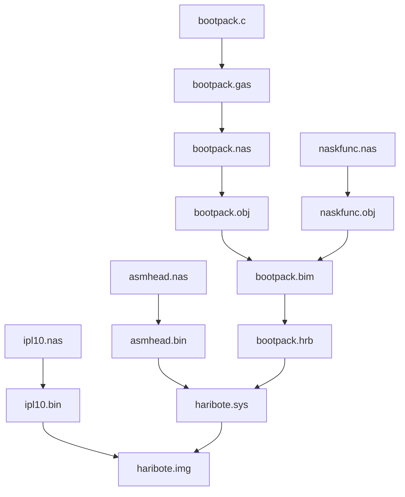

# day3 自制操作系统day3-进入32位模式并导入C语言

## start

这里遇到一个很难过的事情,如果我们向往常一样使用nask + qemu,会发现显示load error

正常来说看这个汇编代码JC应该是不执行,所以进入fin进入循环等待CPU启动,只使用nask直接生成img文件没有磁盘映像这个过程所以说出现问题,JC会直接跳转,显示load error


所以需要一个磁盘映像加入,day2 和 day3的差距主要就是在这里

> 感兴趣的朋友可以顺着makefile去看一下qemu那里的.bat,需要一些其他的BIOS来启动

|day|makefile|
|:--:|:--:|
|day2||
|day3||

接着加入了读取失败重启的过程,使用AH=0X00,DL=0X00,INT 0X13进行系统复位

```asm
retry:
		MOV		AH,0x02			; AH=0x02 : 读取磁盘
		MOV		AL,1			; AL=1 : 读取第1个扇区
		MOV		BX,0
		MOV		DL,0x00			; DL=0x00 : 读取第1个簇(A驱动器)
		INT		0x13			; 读取磁盘
		JNC		fin				; 读取成功,跳转到fin
		INC		SI				; 读取失败次数+1
		CMP		SI,5			; 读取失败次数>5,跳转到fin
		JG		fin				; 跳转到fin
		MOV 	AH,0x00			; AH=0x00 : 停止磁盘
		MOV 	DL,0x00			; DL=0x00 : 停止第1个簇(A驱动器)
		INT		0x13			; 停止磁盘
		JMP		retry			; 重试
```

## 着手开发操作系统



使用make install的时候出现如下报错是因为不是软盘,和64位系统不兼容

```bash
process_begin: CreateProcess(NULL, w a: haribote.img, ...) failed.
make (e=2): 
make: *** [install] Error 2
```


使用最简单的`haribote.nas`,运行`make img`得到如下的结果


向一个空软盘保存文件的时候

- 文件名写在0x002600以后的地方
- 文件的内容会写在0x004200以后的地方


这一部分的地址分配比较复杂,可能你读到这里有很多疑惑,作者也没有解释很清楚,我来解释一下

首先推荐阅读一下阮一峰老师的[计算机是如何启动的?](http://www.ruanyifeng.com/blog/2013/02/booting.html)

简单来说就是如下五个过程:

- 通电
- 读取ROM里面的BIOS,用来检查硬件
- 硬件检查通过
- BIOS根据指定的顺序,检查引导设备的第一个扇区（即主引导记录）,加载在内存地址 0x7C00
- 主引导记录把操作权交给操作系统

接下来阅读[为什么主引导记录的内存地址是0x7C00?](http://www.ruanyifeng.com/blog/2015/09/0x7c00.html)


启动区之后,接下来0x7e00 - 0x9fbff的区域都是没有特别用途的,操作系统可以所以使用,作者于是选择了0x8000这个地址作为操作系统的起始地址,**没什么特殊的理由**(见P49).


我们在ipl.nas的汇编中显示指定了`ORG 0x7c00`,如果不用ORG规定则汇编得到的目标程序将从0000H开始.根据内存地址的分配,0x7c00-0x7dff用作启动区,也就是我们的ipl.nas编译后的`ipl.bin`,这个文件具有16 x 32 = 512(字节)大小,是分离出来的启动区

我们使用nask制作512字节的启动区,对应makefile中的

```makefile
ipl.bin : ipl.nas Makefile
	$(NASK) ipl.nas ipl.bin ipl.lst
```

然后利用制作好的启动区,再使用磁盘映像管理工具来制作整个磁盘映像.


总结一下整体的启动流程

计算机启动首先是BIOS程序硬件自检,硬件自检完成之后BIOS把控制权转交给下一阶段的启动程序,这个启动程序读取该设备的第一个扇区,也就是读取最前面的512个字节.

该主引导程序的位置是0x7c00,如果这512个字节的最后两个字节是0x55和0xAA,表明这个设备可以用于启动；如果不是,表明设备不能用于启动,控制权于是被转交给"启动顺序"中的下一个设备

我们将这段程序放置到内存的0x7c00的位置,并且最后两个字节也是0x55和0xAA,所以启动区正常启动


"主引导记录"只有512个字节,放不了太多东西。它的主要作用是,告诉计算机到硬盘的哪一个位置去找操作系统

现在的分布是,0x7c00-0x7dff存放了启动区的程序`ipl.bin`,0x8000-0x81ff也存放了启动区的程序`ipl.bin`,这个程序保存了两份.

我们在启动区中设计了从软盘(硬盘)中读取数据,它们会被导入到内存的0x8200-0x34fff处.


我们的操作系统一开始并不在内存中,启动区的程序将这部分内容复制到了内存. 最后我们在启动区程序的最后将CPU的指针跳转到了0xc200的位置


0xc200的位置是因为整个操作系统处于映像文件(img)的0x4200的相对位置,而我们将img保存到了内存的0x8000起始位置,所以操作系统开始的相对位置就是 0x8000 + 0x4200 = 0xc200

接下来控制权转交给操作系统,操作系统开始准备载入内核程序,初始化等等操作,启动步骤完成


总之一片漆黑是搞出来了


接下来就是无情的打字机器了,当然你可以选择复制下来,不过我还是习惯一行一行对着打下来~

`haribote.nas` 新增了很多内容,看不懂,作者也建议先跳过. 命名被修改为了 `asmhead.nas`,应该是作为初始启动的一些必要设置

## C语言的编译链接

C语言出现了,那么这个`bootpack.c`是如何变成机器语言与之前写的汇编语言链接到一起的呢?

> 一开始我略过了这一部分,现在回来把这里补上,我觉得这里比较重要,因为后面的很多内容都和这里息息相关.这里如果没有理解编译的过程后面有一些吃力

现在操作系统一共有四个文件

- ipl10.nas : 启动区程序
- asmhead.nas : 初始化的所有参数,包括键盘鼠标,显示器等等标志位
- naskfunc.nas 和 bootpack.c

其中我们可以看到 bootpack.c 中定义了一个函数`io_hlt`但是并没有函数的实现,而naskfunc.nas中定义了一个函数_io_hlt并且使用汇编做了实现.

bootpack可以调用这个函数使整个程序中断在这里,这也体现了C语言底层的特点,可以和操作系统/汇编直接链接

然后我们来看一下Makefile文件中文件的关联关系,我用一个流程图来简单演示一下文件之间的关系




这个图就是最后映像文件生成的makefile依赖关系

其中比较关键的就是obj文件之间的链接,这与gcc编译器的链接过程相同,这也提示我们不仅可以使用 `.h .c`文件实现C语言的定义和实现,也可以使用汇编语言完成更为底层的操作

